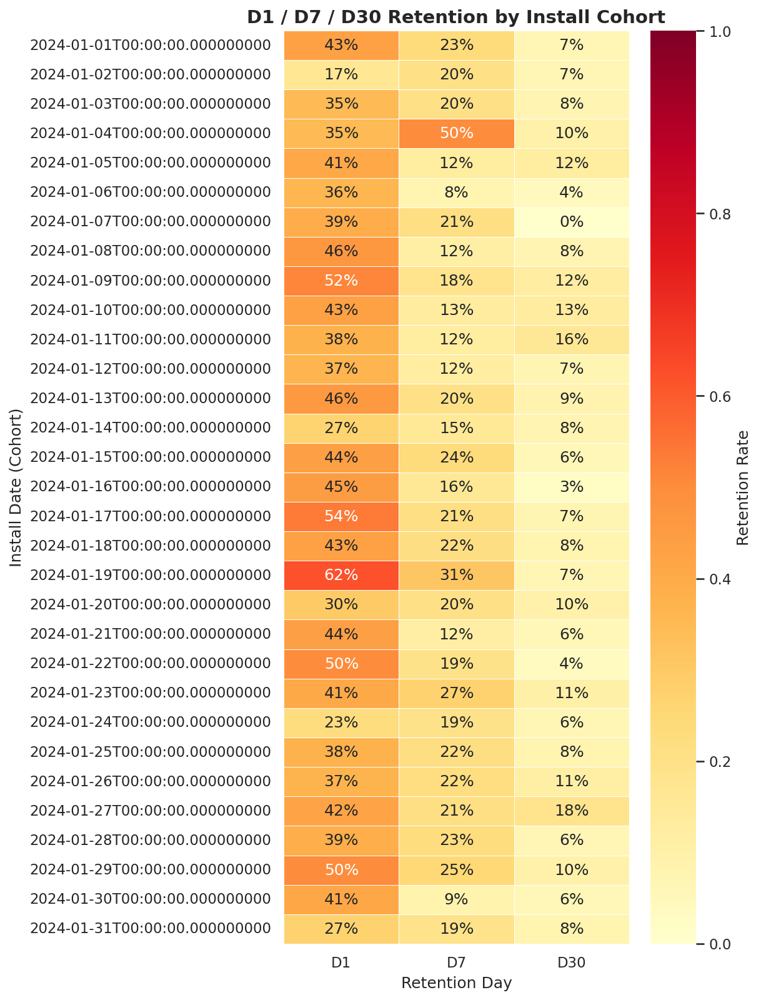
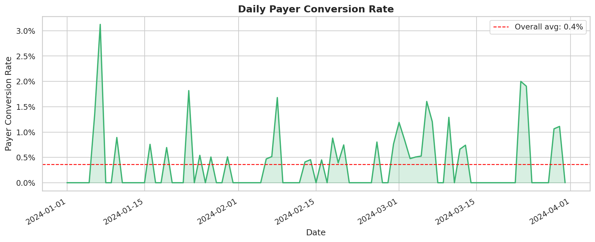
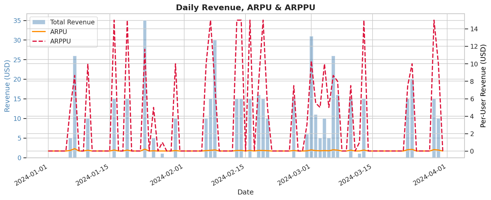
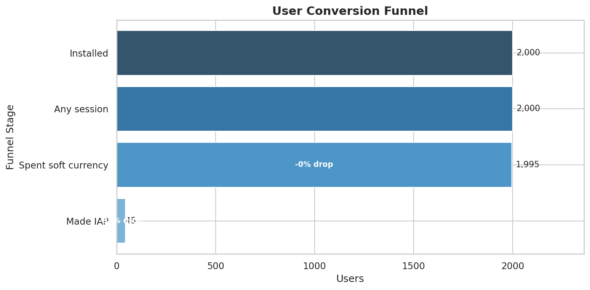
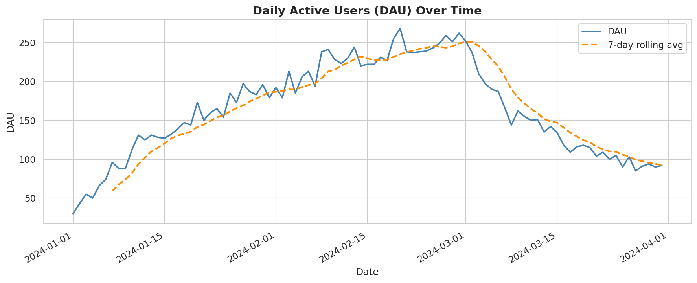

# Game Economy Report — Monetization & Retention Analysis

**Project:** In-Game Economy & Monetization Analytics  
**Author:** Maxi Pagliero  
**Status:** Analysis complete  

---

## Executive Summary

This report analyzes the in-game economy of a free-to-play mobile game using player activity,
session, and transaction data. The goal is to understand monetization performance, player
retention, and conversion behavior — and translate findings into actionable recommendations
for game and monetization designers.

The game shows healthy early retention and a clear engaged player base, but monetization
efficiency is low. The core opportunity lies in converting a larger share of active users
into payers, which would have an outsized impact on revenue given the strong ARPPU of
paying users.

---

## Data Overview

| Table | Description |
|---|---|
| `raw.users` | Player base, install dates, acquisition channels |
| `raw.sessions` | Session-level activity per player |
| `raw.items` | Shop catalogue (soft, hard currency, IAP items) |
| `raw.economy_events` | All economy transactions (earn, spend, IAP purchases) |

KPIs are computed as views in the `curated` schema and queried directly in the analysis
notebooks. See `sql/02_kpi_queries.sql` for the full SQL definitions.

---

## Key Metrics

| Metric | Value |
|---|---|
| Average DAU | 164 |
| Total Revenue | $478.46 |
| Overall ARPU | $0.03 |
| Overall ARPPU | $8.86 |
| Payer Conversion Rate | 0.4% |
| Avg D1 Retention | 39.1% |
| Avg D7 Retention | 19.6% |
| Avg D30 Retention | 8.1% |

---

## Findings

### 1. Retention drops sharply after Day 1

D1 retention averages **39.1%** — meaning roughly 4 in 10 players return the day after
install. This is within a typical mobile game benchmark range (30–40%). However, the
drop from D1 to D7 is steep: only **19.6%** of players are still active by Day 7, and
just **8.1%** survive to Day 30.

This pattern suggests the game has a reasonable first-session hook but struggles to
maintain engagement in the first week. The Day 1 → Day 7 window is where the biggest
retention opportunity lies.

---

### 2. Payer conversion is very low

Only **0.4%** of daily active users make a purchase on any given day. While payer
conversion in free-to-play games is typically low (industry average is 1–5%), 0.4% is
at the low end and represents a significant revenue gap.

The contrast with ARPPU is notable: when players *do* pay, they spend an average of
**$8.86** per transaction — a healthy figure. The problem is not spend depth, it is
reach. The game has willing payers, but not enough of them.

---

### 3. Revenue is heavily concentrated in a small payer segment

The gap between ARPU ($0.03) and ARPPU ($8.86) is large — a ratio of roughly 275x.
This means total revenue is driven almost entirely by a very small group of paying users.
This concentration creates risk: revenue is fragile if those payers churn or reduce spend.

Broadening the payer base — even modestly — would significantly reduce this concentration
and stabilize revenue.

---

### 4. Most users never reach a purchase

The funnel reveals where users drop off on the path to monetization:

- Nearly all installs result in at least one session (good onboarding)
- A meaningful share engage with the soft currency economy (spend coins)
- Very few make it to an IAP purchase

The largest drop-off happens between soft currency engagement and real-money purchase.
This is the most actionable friction point in the funnel.

---

### 5. DAU is stable but small

Average DAU is **164** with no strong growth or decline trend. The player base is stable,
which provides a reliable foundation for monetization experiments. However, scale is
limited — any conversion improvements will need to be validated at larger user volumes
in a real production setting.

---

## Recommendations

**1. Improve Day 1 → Day 7 retention**  
Focus on what happens in sessions 2–5. Add a progression hook, daily reward, or early
narrative milestone that gives players a reason to return within 48 hours. A 5 percentage
point improvement in D7 retention would compound significantly on LTV.

**2. Run a pricing experiment on the first IAP offer**  
The first purchase is the hardest conversion. Test a discounted "starter pack" targeted
at users who have spent soft currency but never made a real-money purchase. Given ARPPU
of $8.86, even a $1.99 entry offer that converts 1–2% more users would meaningfully
move ARPU.

**3. Introduce a soft-to-hard currency bridge offer**  
Users who actively spend soft currency are already engaged with the economy. A contextual
offer at the moment of soft currency depletion (e.g. "Get 100 gems for $0.99") could
accelerate the transition from free engagement to paying.

**4. Segment payers vs. non-payers for targeted live-ops**  
With only 0.4% conversion, the majority of active users have never been exposed to a
compelling purchase moment. Design live-ops events (limited-time offers, seasonal bundles)
specifically targeting non-payers who show high soft currency activity.

---

## What This Would Look Like in Production

In a real studio environment this analysis would be extended with:

- **Larger data volumes** — hundreds of thousands of DAU rather than ~164
- **Real acquisition cost data** — to compute CAC and true LTV by channel
- **ML-based LTV prediction** — propensity models to identify likely future payers early
- **Automated KPI monitoring** — pipeline alerts when ARPU or D1 retention drop below threshold
- **A/B test infrastructure** — to run and evaluate the pricing experiments recommended above

The SQL + Python architecture used here (raw → curated schema, views as the data contract
between SQL and notebooks) is designed to scale directly into a production data warehouse
like BigQuery or Snowflake with minimal changes.

---

## Notebooks & Code

| File | Description |
|---|---|
| `notebooks/01_explore_data.ipynb` | Raw data exploration and quality checks |
| `notebooks/02_kpis_and_visuals.ipynb` | KPI computation and chart generation |
| `sql/01_schema.sql` | Raw and curated schema definitions |
| `sql/02_kpi_queries.sql` | Curated views (DAU, ARPU, retention, funnel) |
| `src/generate_data.py` | Synthetic data generator |